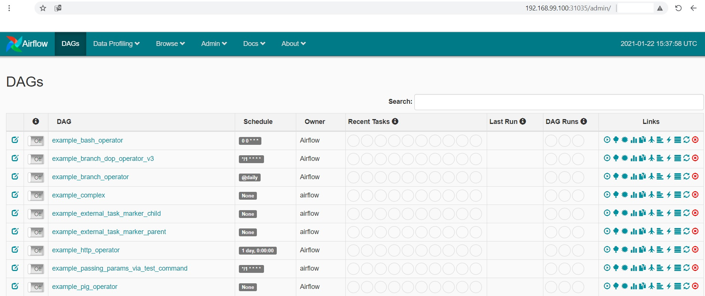

# airflow

## command set
```
kubectl create deployment airflow --image=puckel/docker-airflow:latest --dry-run -o yaml > airflow_deployment.yml
kubectl expose deployment airflow --type=NodePort --port=8080 --dry-run -o yaml > airflow_service.yml
kubectl apply -f airflow_deployment.yml
kubectl apply -f airflow_service.yml
```

## additional commands for LOAD_EX=y
### verify env LOAD_EX is not set in container
```
kubectl exec --stdin --tty airflow-5846f74896-vh8p4 -- /bin/bash
env | grep LOAD_EX
```

### setting env parameter in deploy
```
kubectl set env deployment airflow LOAD_EX=y
kubectl get pods
```

### verify env LOAD_EX is set in container
```
kubectl exec --stdin --tty airflow-f89c9c98c-bcppj -- /bin/bash
airflow@airflow-f89c9c98c-bcppj:~$ env | grep LOAD_EX
LOAD_EX=y
```

## finding minikube's IP
minikube ip<br/> 
example result: 192.168.99.100

## finding service nodeport port
kubectl describe service airflow

```
Name:                     airflow
Namespace:                default
Labels:                   app=airflow
Annotations:              <none>
Selector:                 app=airflow
Type:                     NodePort
IP Families:              <none>
IP:                       10.102.7.159
IPs:                      10.102.7.159
Port:                     <unset>  8080/TCP
TargetPort:               8080/TCP
NodePort:                 <unset>  31035/TCP
Endpoints:                172.17.0.7:8080
Session Affinity:         None
External Traffic Policy:  Cluster
Events:                   <none>
```
  
## access superset from web browser
http://[minikube ip]:[NodePort]<br/>
example: http://192.168.99.100:31035

## output


